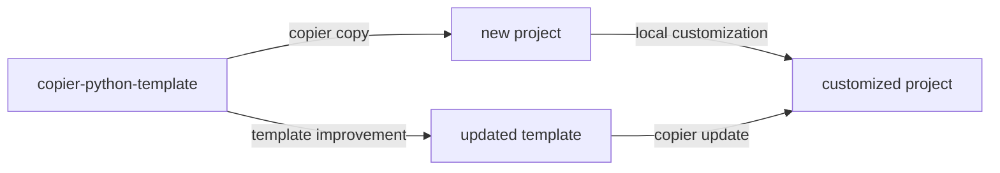

# H&H Ensemble Modeling Toolkit

The H&H Ensemble Modeling Toolkit (hhemt) orchestrates coupled TRITON-SWMM flood simulations as embarrassingly-parallel ensembles across local workstations and HPC clusters, using configurable CPU or GPU resources per simulation on both NVIDIA and AMD hardware. It manages the full lifecycle — preprocessing, compilation, execution, and post-processing — producing analysis-ready datasets and an interactive report.

- [Tutorials](tutorials/index.md)
- [How-To Guides](how-to/index.md)
- [Reference](reference/index.md)
- [Explanation](explanation/index.md)

## Template update workflow

This project was generated from [copier-python-template](https://github.com/lassiterdc/copier-python-template). Template improvements can be pulled in at any time:

```bash
copier update --skip-tasks
```

The diagram below shows how the template ecosystem works:


