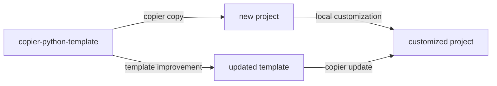

# TRITON-SWMM Toolkit

Orchestrates coupled TRITON (2D hydrodynamic) and SWMM (stormwater management) simulations across local machines and HPC clusters.

- [Tutorials](tutorials/index.md)
- [How-To Guides](how-to/index.md)
- [Reference](reference/index.md)
- [Explanation](explanation/index.md)

## Template update workflow

This project was generated from [copier-python-template](https://github.com/lassiterdc/copier-python-template). Template improvements can be pulled in at any time:

```bash
copier update --skip-tasks
```

The diagram below shows how the template ecosystem works:


